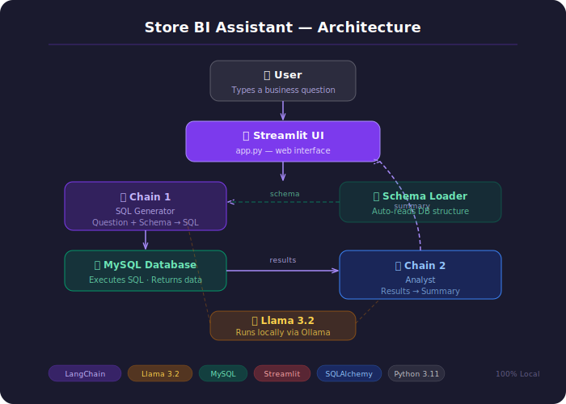

# Store BI Assistant

> An AI-powered Business Intelligence tool that lets non-technical users 
> ask business questions in plain English and get instant answers from a 
> real database — no SQL knowledge required.**


---

##  Problem Statement

Business users in most organizations cannot self-serve data insights 
because they don't know SQL. They rely on data analysts for every 
question, creating bottlenecks and delays. This project eliminates 
that dependency by letting anyone type a question in plain English 
and get an instant, accurate answer.

---
## ✨ Features

| Feature | Description |
|---|---|
|  **Natural Language Querying** | Ask any business question in plain English — no SQL needed |
|  **Local AI — No API Keys** | Llama 3.2 runs fully on your machine via Ollama — zero cost, full privacy |
|  **Two-Chain Pipeline** | Chain 1 generates SQL, Chain 2 interprets results — each with a focused prompt |
|  **Self-Healing Retry** | Failed SQL queries are automatically corrected and retried once |
|  **Auto Schema Detection** | Database structure is read automatically — no manual configuration |
|  **Interactive Results Table** | Query results displayed as a sortable, filterable dataframe |
|  **Business Summary** | Every result comes with a plain-English analyst summary |
|  **Privacy First** | All data stays on your machine — nothing sent to external servers |
|  **Example Questions** | Pre-built example questions for instant demo-ready interaction |
|  **Dark UI** | Polished purple-gradient Streamlit interface |

---
##  Demo

**Ask:** "Which product category had the most revenue?"

**Gets back:**
-  The SQL query that was generated
-  A results table with real data
-  A plain-English business summary

---

## Architecture



---


##  How It Works

### Chain 1 — SQL Generator
Takes the user's natural language question and the full database 
schema, sends both to Llama 3.2 running locally via Ollama, and 
receives a valid MySQL query back. Uses LangChain Expression 
Language (LCEL) pipe syntax.

### Chain 2 — Analyst
Takes the SQL query results (formatted as a markdown table) and 
sends them to Llama 3.2 with instructions to write a 2-3 sentence 
plain-English business summary starting with the most important finding.

### Self-Healing Retry
If the generated SQL fails on execution, the error message is 
automatically appended to the prompt and the query is regenerated 
once — a production-grade reliability pattern.


## 🔧 Setup & Installation

### Prerequisites
- Python 3.11+
- MySQL 8.0+
- [Ollama](https://ollama.com) installed

### 1. Clone the repository
```bash
git clone https://github.com/yourusername/bi_assistant.git
cd bi_assistant
```

### 2. Install dependencies
```bash
pip install -r requirements.txt
```

### 3. Pull Llama 3.2
```bash
ollama pull llama3.2
```

### 4. Set up environment variables
```bash
cp .env.example .env
# Edit .env with your MySQL credentials
```

### 5. Set up the database
```bash
# Run data/seed_data.sql in MySQL Workbench or CLI
mysql -u root -p < data/seed_data.sql
```

### 6. Run the app
```bash
streamlit run app.py
```

Open [http://localhost:8501](http://localhost:8501) in your browser.

---

## Example Questions

| Question | What it demonstrates |
|---|---|
| Which product category had the most revenue? | GROUP BY + SUM + JOIN |
| Which region has the most customers? | COUNT + GROUP BY |
| How many orders were returned vs completed? | Status filtering |
| Which product has been ordered the most times? | Multi-table JOIN |
| What is the total revenue per customer? | Aggregation + JOIN |

---

## Limitations

- Response time depends on local hardware — Llama 3.2 runs slower on machines 
  without a dedicated GPU, typically taking 20 to 40 seconds per query
- SQL accuracy is not guaranteed for highly complex or ambiguous questions — 
  the model may occasionally generate incorrect queries that require a retry
- The system is built on a small synthetic retail dataset and would need schema 
  updates and prompt adjustments to work on a real production database
- Llama 3.2 3B is a lightweight local model — larger cloud-based models would 
  produce more accurate SQL and richer summaries but require API keys and internet access

---
##  Privacy & Security

All processing runs **100% locally** — no data is sent to external 
APIs. Llama 3.2 runs on your machine via Ollama. This makes the 
system suitable for sensitive business data in regulated industries.

---
